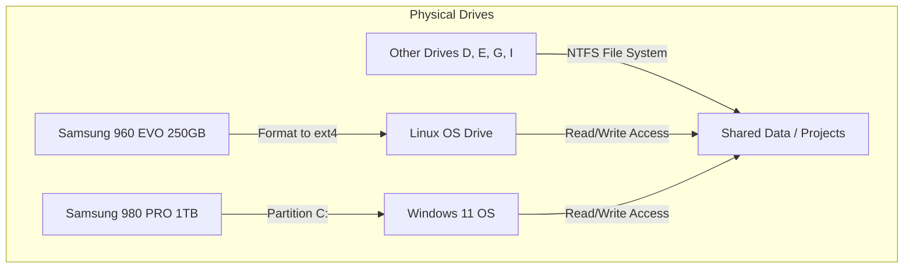
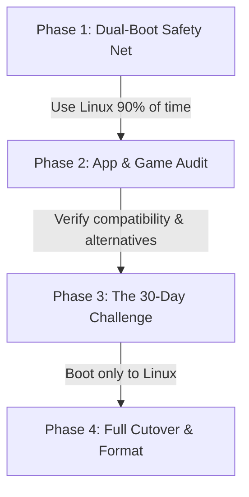

This guide provides a comprehensive analysis of your current PC hardware, developer setup, and storage configuration, along with a structured plan to migrate from Windows 11 to Linux.

---

## 🖥️ System Analysis & Compatibility Summary

Your PC is a high-performance system with excellent hardware specifications that are fully compatible with modern Linux distributions. 

| Component | Your Hardware | Linux Compatibility | Notes / Recommendations |
| :--- | :--- | :--- | :--- |
| **OS** | Windows 11 Pro Insider Preview (64-bit) | N/A | Windows environment can be kept alongside Linux (dual-boot). |
| **CPU** | Intel Core i7-10700K (8C/16T, @ 3.80GHz) | **Excellent (Native)** | Out-of-the-box support in all modern kernels. Hyper-threading and power management are highly optimized. |
| **RAM** | 16 GB | **Excellent** | Perfect for developer workloads, Docker containers, and multitasking. Linux uses memory very efficiently. |
| **GPU** | NVIDIA GeForce RTX 2080 SUPER | **Very Good (Proprietary)** | Requires NVIDIA's proprietary driver. Modern distros make this easy, but we recommend choosing a distro with pre-packaged drivers. |
| **Boot Mode** | UEFI (Required by Win 11) | **Excellent** | UEFI bootloaders (systemd-boot or GRUB) will manage dual-boot seamlessly. |

---

## 💾 Storage Configuration & Allocation Strategy

Your PC has a rich, multi-drive storage setup totaling over 5 TB. Here is how your physical drives map to your logical configuration, along with a migration recommendation:

### Physical Drive Inventory
1. **Samsung SSD 980 PRO 1TB** (High-speed NVMe - OS drive, C:)
2. **Samsung SSD 960 EVO 250GB** (NVMe SSD - currently F: drive, **203 GB free**)
3. **ST32000542AS 2TB** (Seagate Barracuda HDD - data storage, D:)
4. **Hitachi 1TB HDD** (Data storage, E:)
5. **Samsung SSD 850 EVO 500GB** (SATA SSD - data storage)
6. **Intel 120GB SSD** (SATA SSD - scratch/fast storage)

### Recommended Storage Partitioning Plan



> [!TIP]
> **Use your 250GB Samsung 960 EVO SSD as your dedicated Linux drive.**
> It currently acts as your `F:` drive and has 203 GB of free space. Installing Linux on this drive avoids having to shrink your main Windows `C:` partition, drastically reducing the risk of data loss. You can wipe this drive (after backing up any files on `F:`) and use it entirely for Linux.

### Shared Access to Data Drives (NTFS)
Linux has native, high-performance read/write support for NTFS file systems via the kernel-level `ntfs3` driver or `ntfs-3g`. You will be able to access your code projects on `D:`, `E:`, `G:`, or `I:` directly from Linux.

---

## 🛠️ Developer Workflow Migration

You are currently working on a Node.js project utilizing Docker and running PowerShell scripts (`build-and-push.ps1`). Here is how your stack translates to Linux:

### 1. Docker
* **On Windows**: Runs inside a WSL2 utility VM, which adds memory and CPU virtualization overhead.
* **On Linux**: Runs **natively** directly on the host kernel. You will experience significantly faster container build times, faster start times, and lower RAM consumption.
* **Transition**: You will install `docker-ce` and `docker-compose-plugin` via your package manager.

### 2. Node.js
* **Performance**: Node.js and package managers (`npm`/`yarn`/`pnpm`) run faster on Linux, especially filesystem-heavy tasks like `npm install` because Linux filesystems (ext4) handle small-file I/O much quicker than NTFS.
* **Transition**: Install Node.js using a version manager like `fnm` or `nvm` instead of system packages to manage versions cleanly.

### 3. Shell Scripts: PowerShell to Bash
Your build script [build-and-push.ps1](file:///C:/Users/DJ/Documents/antigravity/friendly-newton/build-and-push.ps1) is written in PowerShell. While PowerShell Core (`pwsh`) is available on Linux, migrating to a native Bash script is standard practice.

Here is a side-by-side transition:

#### Native Linux Bash Version (`build-and-push.sh`)
```bash
#!/usr/bin/env bash
# Build and Push script for NewtonFit Docker Image
# Tags the image for ghcr.io/scarredninja/newtonfit on GHCR.

# Exit immediately if a command exits with a non-zero status
set -e

# ANSI Color codes for clean console output
CYAN='\033[0;36m'
GREEN='\033[0;32m'
RED='\033[0;31m'
NC='\033[0m' # No Color

echo -e "${CYAN}==========================================${NC}"
echo -e "${CYAN}🚀 Building NewtonFit Docker Image...${NC}"
echo -e "${CYAN}==========================================${NC}"

docker build -t ghcr.io/scarredninja/newtonfit:latest .

echo -e "\n${GREEN}==========================================${NC}"
echo -e "${GREEN}⬆️ Pushing NewtonFit to GitHub Container Registry...${NC}"
echo -e "${GREEN}==========================================${NC}"

docker push ghcr.io/scarredninja/newtonfit:latest

echo -e "\n${GREEN}✅ Done! The image ghcr.io/scarredninja/newtonfit:latest is now available on GHCR.${NC}"
echo -e "${GREEN}You can now redeploy the Swarm Stack in Portainer.${NC}"
```

---

## 🎮 Gaming on Linux: State of Play

Gaming on Linux is in a golden age, largely thanks to Valve's work on **Proton** (the compatibility layer powering the Steam Deck). Your **RTX 2080 SUPER** will deliver excellent performance, but you need to know what works and what doesn't.

### 1. Steam & Proton
* **How it works**: In Steam settings, you simply enable "Steam Play for all other titles," and Steam will automatically run Windows games through Proton.
* **Compatibility Check**: Search your game library on [ProtonDB](https://www.protondb.com/). Games rated **Platinum** or **Gold** run flawlessly with near-identical or sometimes better performance than Windows.
* **Supported Games**: *Cyberpunk 2077, Elden Ring, Baldur's Gate 3, GTA V / GTA Online, Helldivers 2, Apex Legends, The Witcher 3, Monster Hunter: World, Hogwarts Legacy.*

### 2. The Anti-Cheat Blocker (Critical Warning)
Games that utilize **kernel-level anti-cheat** will NOT run on Linux because they require deep Windows kernel integration that cannot be translated.
* **❌ WILL NOT RUN**: *Valorant (Vanguard), Fortnite (EAC on Linux is blocked by Epic), Call of Duty: Warzone / MW3 (Ricochet), League of Legends (Vanguard), Destiny 2.*
* **✅ WILL RUN**: *Counter-Strike 2 (Native), Team Fortress 2, Apex Legends (EAC enabled for Linux), Overwatch 2, Dota 2.*

### 3. Non-Steam Games & Launchers
* **Heroic Games Launcher**: A beautiful, native client for Epic Games Store, GOG, and Amazon Games.
* **Lutris / Bottles**: Tools that download and configure launchers like Battle.net, EA Desktop, and Ubisoft Connect, managing the Wine/Proton wrappers automatically.

---

## 📱 Everyday Apps & Alternatives

For a full everyday OS, here is how standard Windows apps translate to Linux:

| Windows Application | Linux Native? | Linux Best Practice / Alternative |
| :--- | :---: | :--- |
| **Google Chrome / Brave / Edge** | **Yes** | Fully native. Chrome/Brave are identical. Microsoft Edge has a native Linux build. |
| **Microsoft Office (Word/Excel)** | **No** | **Microsoft 365 Web** (runs in browser), **ONLYOFFICE** (excellent local compatibility), or **Google Workspace**. |
| **Adobe Creative Suite (Photoshop/Premiere)** | **No** | **DaVinci Resolve** (Industry-standard video editing, native), **GIMP** (Photoshop alternative), **Krita** (Digital painting). |
| **Discord** | **Yes** | Fully native client. *Note: Screen share audio sometimes needs a tool like `Vesktop` or Discord-screen-share wrapper.* |
| **Spotify / VLC / Plex** | **Yes** | Fully native clients available in software centers. |

---

## 🎛️ Peripheral & Hardware Control

Hardware software (like Razer Synapse, Corsair iCUE, Logitech G Hub, or NZXT Cam) does not exist on Linux. However, the open-source community has built excellent alternatives:

* **RGB Lighting Control**: **[OpenRGB](https://openrgb.org/)** is an outstanding tool that lets you control the RGB lighting of your RTX 2080 Super, motherboard, RAM, and keyboard/mouse in one single app.
* **Gaming Mice Configuration**: **Piper** is a clean UI that configures gaming mouse DPI, polling rates, and button bindings (powered by `libratbag`).
* **Hardware Monitoring**: **MangoHud** provides an on-screen display (FPS, frame times, CPU/GPU temperature, and load) while gaming, similar to MSI Afterburner / RivaTuner.

---

## 🔄 Phased Full Migration Strategy

To fully decommission Windows without disruption, follow this phased strategy:



### Phase 1: Dual-Boot Safety Net (1-2 Weeks)
Set up a dual-boot as outlined in the installation steps. Use Linux for everything (development, browsing, everyday tasks). Only boot into Windows if you absolutely have to play a banned anti-cheat game or use a specific Windows-only app.

### Phase 2: Game & App Audit
Keep a list of what forced you back to Windows.
* Can those games run? Check [ProtonDB](https://www.protondb.com/).
* Can those apps run via **Wine** or **Bottles**? 
* If they are anti-cheat games (like Valorant), decide if you are okay giving them up or keeping a small Windows partition just for those games.

### Phase 3: The 30-Day Challenge
Commit to not booting into Windows for 30 days. If you successfully complete this phase, you are ready to fully decommission Windows.

### Phase 4: Full Windows Decommissioning
1. Boot into Linux.
2. Open the **Disks** utility or **GParted**.
3. Format the 1TB Samsung 980 PRO partition (formerly C:) to **ext4** or **Btrfs**.
4. Mount this drive as `/home/data` or merge it to gain access to 1TB of ultra-fast NVMe storage entirely for your Linux games and files.

---

## 🖥️ Running Windows in a Virtual Machine (VM): The Good & The Bad

Using a Windows VM on Linux is a highly effective way to isolate Windows bloat while retaining access to critical Windows-only software. However, its feasibility depends entirely on *what* you want to run inside it.

### 1. Productivity, MS Office, and Adobe Apps (Highly Feasible)
* **How it works**: You can use **Virt-Manager (QEMU/KVM)** or **VirtualBox** to create a lightweight Windows VM.
* **Performance**: KVM (Kernel-based Virtual Machine) runs Windows at near-native CPU speeds. It is perfect for MS Office, Adobe Photoshop (with basic acceleration), or running Windows-only desktop utilities.
* **Complexity**: **Low to Medium**. Setting up a basic Windows VM takes about 15 minutes.
* **Bloat Factor**: Since the VM is isolated, Windows telemetry, background updates, and bloatware cannot slow down your main Linux host.

### 2. Gaming in a VM via GPU Passthrough (Advanced & Complex)
Because virtualized GPUs cannot run heavy 3D games, you must pass your physical graphics card directly to the VM.
* **How it works (VFIO)**: You configure KVM/QEMU to give the Windows VM direct control of your **NVIDIA RTX 2080 SUPER**. 
* **The Dual-GPU Advantage**: Your Intel i7-10700K has an integrated graphics card (**Intel UHD 630**). You can run Linux on the Intel graphics (connecting your monitor to the motherboard HDMI/DisplayPort) and dedicate the RTX 2080 SUPER exclusively to your Windows VM. This gives the VM **98% native gaming performance**.
* **Complexity**: **High**. It requires editing kernel boot parameters, BIOS setups, and XML configurations. It is not recommended for a "simple" setup.

### 3. The Anti-Cheat Pitfall in VMs (The Hard Blocker)
Even with a high-performance GPU Passthrough VM, **kernel-level anti-cheat games (Valorant/Vanguard, League of Legends/Vanguard, etc.) will STILL not work**.
* These anti-cheat drivers actively scan the system hardware, detect that they are running inside a virtualized environment (KVM/QEMU/Hyper-V), and refuse to launch to prevent cheating vectors.
* There are XML bypass hacks for some games (like Fortnite or Apex), but they are a cat-and-mouse game and can result in account bans. For **Valorant/Vanguard**, there is currently no public bypass.

> [!IMPORTANT]
**Summary on VMs**: 
* **Do it for**: Office, Adobe, and standard Windows apps. It keeps Windows completely sandboxed and bloat-free.
* **Avoid it for**: Kernel-level anti-cheat games (you must dual-boot for these).

### 4. Server-Hosted Windows VM (The Ultimate Clean Desktop)
If you have a home server (e.g., running Proxmox, unRAID, or KVM), hosting the Windows VM on the server is a highly elegant solution:
* **How it works**: Run Windows on your server and connect from Linux using a client like **Remmina** (using RDP) or **Moonlight/Sunshine** (for ultra-low latency, smooth UI, and GPU-accelerated streaming).
* **The Benefit**: Zero local performance overhead, zero local disk consumption, and your desktop remains 100% bloat-free.

---

## 🐧 Recommended Linux Distributions (Distros)

Because you have an **NVIDIA RTX 2080 SUPER**, driver setup is a critical decision.

### 🏆 Our Top Recommendation: Pop!_OS (NVIDIA Edition)
For your hardware and developer workflow, **Pop!_OS** is the absolute best starting point.
* **Out-of-the-Box NVIDIA Drivers**: Pop!_OS offers a dedicated installer download with the NVIDIA proprietary drivers already loaded into the bootable image. You won't face black screens or driver installation failures upon first boot.
* **Built for Creators & Developers**: System76 (the creators of Pop!_OS) builds laptops and desktops for engineers, scientists, and creators. The OS includes tools specifically tailored for developers.
* **Auto-Tiling Windows**: It features a native window auto-tiling toggle. If you code with multiple windows (IDE, terminal, browser), this organizes your screen instantly without manual resizing.
* **The System76 Scheduler**: It dynamically prioritizes the CPU/GPU resources of the active window (whether it is VS Code, Docker builds, or a game) ensuring maximum responsiveness.

### Alternative: Linux Mint 22 (Cinnamon)
* If you want a desktop layout that feels **exactly like Windows 11** (start menu in the bottom-left, classic taskbar), Linux Mint is incredibly polished and very friendly for beginners.

---

## 💾 Moving Linux to the 1TB NVMe Later (Is it needed?)

If you start on the **250GB Samsung 960 EVO** and later want to migrate the main Linux OS to the **1TB Samsung 980 PRO** (wiping Windows entirely):

### 1. Performance Difference
* Both drives are high-speed NVMe SSDs.
* The 980 PRO is PCIe Gen 4 (read speeds up to 7,000 MB/s), while the 960 EVO is PCIe Gen 3 (read speeds up to 3,200 MB/s). 
* **Real-world feel**: In everyday use, system boot times, app launches, and coding compilation speeds will feel **virtually identical** on both drives. You won't notice a human-perceptible difference running the OS on one vs. the other.

### 2. Space Considerations (The Smart Workaround)
If the 250GB drive begins to fill up with Docker images, games, or projects, **you do not need to move the OS**. 
* On Linux, you can format a partition on your 1TB drive (or any other SSD/HDD) as `ext4` and mount it to *any folder* in your system.
* For example, you can mount a partition of your 1TB drive directly to your home folder (`/home/dj/Projects` or `/home/dj/.local/share/Steam`), so your games and heavy docker data sit on the 1TB SSD while your OS remains on the 250GB SSD. This is highly flexible and easy to do!

### 3. Migrating Later
If you eventually decide you want Linux on the 1TB drive as the *primary OS boot drive*, you can:
* Use a cloning tool like **Clonezilla** to copy the 250GB partition to the 1TB partition.
* Simply perform a clean installation on the 1TB drive (takes less than 10 minutes) and copy over your home directory configurations (`.config` folders) to restore your workspace.

---

## 📋 Step-by-Step Migration Plan

If you decide to proceed with a **Dual-Boot setup** (keeping Windows 11 on the 1TB drive and placing Linux on the 250GB SSD):

### Step 1: Backup & Preparation
1. Backup any data on your Samsung 960 EVO 250GB SSD (`F:` drive), as we will format it.
2. Ensure you have a spare USB flash drive (8GB+).
3. Back up your Windows files just in case.

### Step 2: Create a Bootable USB
1. Download **Pop!_OS (NVIDIA edition)** or your chosen distro ISO.
2. Download [Rufus](https://rufus.ie/) or [Ventoy](https://www.ventoy.net/).
3. Flash the ISO to your USB drive.

### Step 3: BIOS/UEFI Settings
1. Restart your PC and enter the BIOS (usually by pressing `Del` or `F2`).
2. **Disable Fast Boot** (can interfere with dual-boot detection).
3. **Disable Secure Boot** if installing a distro that doesn't sign its bootloaders (Ubuntu/Pop!_OS usually support Secure Boot, but disabling it avoids certificate issues with NVIDIA drivers).
4. Verify SATA mode is set to **AHCI** (not RAID/Optane).

### Step 4: Installation
1. Boot from the USB drive (press `F11` or `F12` during boot to select the USB).
2. Choose your language and keyboard layout.
3. Select **Custom (Advanced) installation**.
4. Identify your **Samsung 960 EVO 250GB SSD** (be extremely careful not to select the 1TB 980 PRO or other data drives).
5. Format the 250GB drive as **ext4** and set the mount point to `/` (root).
6. Proceed with installation. The installer will automatically add a bootloader entry to allow choosing between Windows 11 and Linux on startup.

### Step 5: Post-Install Developer Setup
1. **Update system packages**:
   ```bash
   sudo apt update && sudo apt upgrade -y
   ```
2. **Install Git & VS Code**:
   ```bash
   sudo apt install git -y
   # Download and install the .deb file for VS Code
   ```
3. **Install Docker**:
   Follow the [Docker Engine installation for Ubuntu/Pop!_OS](https://docs.docker.com/engine/install/ubuntu/).
4. **Mount Data Drives**:
   Use `Disks` (GNOME utility) or edit `/etc/fstab` to auto-mount your storage drives (like your `D:` drive) so they available on boot.

