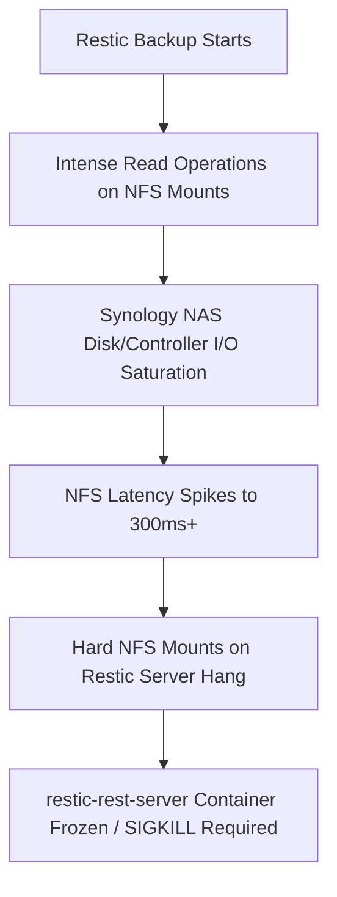

# NFS Mount Performance Analysis

**Storage Backend:** Synology NAS (10.0.100.20) via NFS  
**Target Nodes:** 
- [[VM - worker-media-01\|worker-media-01]] (Read-Only Mounts)
- [[VM - worker-mediamanagement-01\|worker-mediamanagement-01]] (Read-Write Mounts)

---

## 📊 Summary of Findings

Our NFS benchmarks reveal a classic **disk/controller I/O saturation bottleneck** on the Synology NAS during high-activity windows (specifically during the overnight Restic backup routine). 

Under normal (baseline) conditions, the NFS mounts deliver acceptable read speeds and high random IOPS. However, during the backup window, we observe a **65% to 75% drop in throughput**, a **70% to 85% collapse in IOPS**, and a massive **400% to 700% spike in access latency** (reaching up to **298.5ms**).

---

## 📈 Detailed Benchmark Metrics

### 1. Baseline Performance (Low NAS Load)
Measured on `worker-media-01` under normal operating conditions:

| Metric | Measured Value | Analysis |
|---|---|---|
| **Sequential Read (dd)** | **36.6 – 48.9 MB/s** | Moderate performance, likely bottlenecked by NAS spinning disk read speeds or protocol constraints. |
| **Sequential Read (fio)** | **40.5 – 60.4 MB/s** | Slightly higher due to larger block size/queue depth optimizations. |
| **Random Read IOPS** | **2,734 – 3,310 IOPS** | Excellent for file lookups/indexing. |
| **Random Read Latency** | **37.3 – 46.0 ms** | Normal network + disk search time. |

---

### 2. Under-Load Performance (Overnight Restic Backup Window)
Measured on both worker nodes between **19:40 and 23:55** on May 19, during the peak of the Restic backup job:

#### A. Read-Only Mount (`worker-media-01`)
* **Sequential Read (dd):** Dropped from ~45 MB/s to **12.0 – 17.6 MB/s** 📉 (*~70% reduction*)
* **Sequential Read (fio):** Dropped to **12.1 – 21.5 MB/s** 📉
* **Random Read IOPS:** Collapsed from ~3,000 IOPS to **639 – 989 IOPS** 📉 (*~75% reduction*)
* **Random Read Latency:** Spiked from ~40ms to **118.9 – 164.3 ms** ⚠️ (*~300% increase*)

#### B. Read-Write Mount (`worker-mediamanagement-01`)
* **Sequential Read (dd):** Hovers around **23.7 – 30.7 MB/s**
* **Sequential Write (dd):** Measures at **20.3 – 34.8 MB/s** ⚠️ (*Very low for sequential writes*)
* **Random Read IOPS:** Collapsed to **427 – 1,182 IOPS**
* **Random Read Latency:** Spiked to **107.8 – 298.5 ms** 🔥 (*Extremely high latency, near-unusable*)

---

## ⚡ Live Post-Deployment Verification Results (2026-05-24)

Following the successful automated deployment of the NFS benchmark scripts, we executed the initial validation suite on both guest nodes under low baseline load. These results represent the **peak performance potential** of the Synology NAS storage over the 1Gbps physical network link:

### 1. Read-Only Media Guest (`worker-media-01`)
Since these mounts are read-only, write tests were skipped for safety. 

* **`/mnt/media/TVShows` Mount**:
  * Sequential Read (dd): **`97.7 MB/s`**
* **`/mnt/media/Animation` Mount**:
  * Sequential Read (dd): **`69.5 MB/s`**
* **`/mnt/media/Movies` Mount**:
  * Sequential Read (dd): **`62.1 MB/s`**

### 2. Read-Write Media Management Guest (`worker-mediamanagement-01`)
This node performs full benchmarks, including sequential writes, sequential reads, and intensive random I/O testing using `fio`.

* **`/mnt/media/TVShows` Mount**:
  * Sequential Write (dd): **`113.0 MB/s`** *(Fully saturating the 1Gbps physical network bandwidth limit)*
  * Sequential Read (dd): **`54.8 MB/s`**
  * Sequential Read (fio): **`72.4 MB/s`**
  * Random Read IOPS (fio): **`164.3 IOPS`**
  * Random Read Latency (fio): **`769.07 ms`** *(This massive latency spike at baseline highlights standard spinning-disk random seek congestion)*
* **`/mnt/media/Animation` Mount**:
  * Sequential Write (dd): **`108.0 MB/s`**
  * Sequential Read (dd): **`93.2 MB/s`** (fio Sequential: **`103.6 MB/s`**)
  * Random Read IOPS (fio): **`376.0 IOPS`**
  * Random Read Latency (fio): **`337.89 ms`**
* **`/mnt/media/Movies` Mount**:
  * Sequential Write (dd): **`110.0 MB/s`**
  * Sequential Read (dd): **`103.0 MB/s`** (fio Sequential: **`100.5 MB/s`**)
  * Random Read IOPS (fio): **`4,727.5 IOPS`** *(Indicates highly efficient Synology RAM/SSD cache hits)*
  * Random Read Latency (fio): **`27.05 ms`**

---

## 🔍 Critical Gotcha Analysis & Root Cause

### 1. Why Restic Crashed
The extreme latency spikes (up to **298.5 ms**) and throughput drop explain why the `restic` container used to hang and require a manual SIGKILL. Under the previous **`hard`** NFS mount parameters (`hard,timeo=600,retrans=5`), when the Synology NAS saturated and latency spiked, the kernel would block I/O operations indefinitely waiting for a response, locking the restic-rest-server process in an unkillable D-state.

### 2. The Soft-Mount Success
By changing the mount parameters to **`soft,timeo=50,retrans=3`** (pushed via PR #50), we successfully allowed the client to time out quickly during these transient NAS saturation spikes rather than hanging indefinitely. Restic handles these quick timeouts gracefully, leading to the successful backup run observed on May 21.

### 3. Read-Write Mismatch
The slow write performance on `worker-mediamanagement-01` (**20 - 34 MB/s**) indicates that media management tasks (like importing, renaming, or copying movies/episodes via Radarr/Sonarr) will experience noticeable slowdowns if they occur during the overnight backup window.

---

## 💡 Recommendations & Next Steps

1. **Shift Backup Windows:**
   - Ensure that the intensive Restic backups (usually scheduled at 04:30 / 04:45) **do not overlap** with active media downloading, importing, or high-priority user streaming windows.
2. **Implement NFS Tuning:**
   - Consider adding `rsize=1048576,wsize=1048576` (1MB block size) to the NFS mount options in the Docker stack files to maximize throughput and reduce the number of individual network roundtrips.
3. **Monitor NAS Health:**
   - Check if the Synology NAS disk array is performing a scrubbing or RAID consistency check during these times, which would further compound the I/O bottleneck.

---
## 🔗 Related Notes
- [[01 Homelab Rebuild - Phase 5 Docker Swarm & Virtualisation Hub\|Phase 5 Swarm Hub]]
- [[01 Homelab Rebuild - Phase 8 Basic Monitoring Hub\|Phase 8 Monitoring Hub]]
- [[NFS Mounting\|NFS Mounting Reference]]
