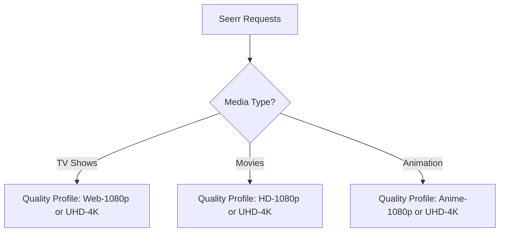

# Quality Profiles & Recyclarr Automation Setup

To solve ratio management (freeleech priority), block low-quality releases (CAM/TS), and prevent massive file sizes and server performance issues, this guide outlines the target setup for Sonarr/Radarr **Quality Profiles** and **Custom Formats** using **Recyclarr** automation.

Reference: [[Service - sonarr]] · [[Service - radarr]] · [[Service - seerr]]

---

## 1. Quality Profile Strategy (TV, Movies, & Animation)

We use a unified library (no physical folder separation between 1080p and 4K) but distinct Quality Profiles depending on the media type.



### Profile A: 1080p Standard (TV & Movies)
* **Qualities (High to Low):**
  1. BluRay-1080p (Preferred)
  2. WEBDL-1080p
  3. WEBRip-1080p
  4. HDTV-1080p (Only as last resort fallback)
* **Cut-off:** WEBDL-1080p (Stops searching once clean WEBDL is found, avoiding unnecessary bandwidth usage of heavy BluRay Remuxes unless explicitly upgraded).

### Profile B: 4K Premium (Movies & TV)
* **Qualities (High to Low):**
  1. BluRay-2160p (Preferred)
  2. WEBDL-2160p
  3. WEBRip-2160p
* **Cut-off:** WEBDL-2160p.

### Profile C: Animation/Anime (1080p)
* **Qualities (High to Low):**
  1. WEBDL-1080p (Preferred — anime streaming services like Crunchyroll often have higher visual quality than standard TV WEBDL)
  2. BluRay-1080p
* **Custom Format Scoring:** Prioritize subbed/dubbed audio tags and preferred anime release groups (e.g. `SubsPlease`, `Erai-raws`).

---

## 2. Custom Format Filters (CAMs, Freeleech, & Sizes)

Custom Formats allow assigning **scores** to specific features of releases. A release with a higher score is preferred and will upgrade an existing file of the same quality.

### Exclusion Filters (Score: -10000 / Hard Block)
To prevent low-quality releases, we define custom formats that act as hard blocks:
* **CAM / TS / TC:** Matches `CAM`, `TELESYNC`, `TS`, `TELECINE`, `TC`, `SCREENER`, `SCR`, `WORKPRINT`.
* **3D Content:** Matches `3D`, `H-SBS`, `H-OU` (unless you have a 3D setup).

### Performance & Size Limit Protections
To prevent massive storage consumption (e.g., 80GB Remuxes) which causes heavy ZFS disk I/O and Plex CPU transcoding lag:
* **Radarr Max Size Rules:**
  - **1080p Movies:** Limit to maximum 15 GB (WEBDL/BluRay).
  - **4K Movies:** Limit to maximum 45 GB (Avoids 80GB Remuxes while preserving HDR/Atmos).
* **Sonarr Max Size Rules:**
  - **1080p Episodes:** Limit to maximum 3.5 GB per 45-minute episode.

### Freeleech & Ratio Preservation Scoring (Score: +100)
To prioritize freeleech torrents on private trackers (preventing ratio depletion):
* **Custom Format `Freeleech`:**
  - RegEx match: `\b(freeleech|double-seed|gold|50%-freeleech)\b` in torrent titles.
  - Score: **+100** points.
  - This ensures that if a freeleech release and a normal release of the same quality are available, Sonarr/Radarr will choose the freeleech release.

---

## 3. Recyclarr Automation Deployment

Recyclarr automatically syncs these settings directly from TRaSH Guides to your Sonarr and Radarr API endpoints, avoiding hours of manual web UI entry.

### Step 1: Add Recyclarr to `stack-arr.yml`
We can run Recyclarr as a lightweight, scheduled service alongside Sonarr/Radarr.

```yaml
  recyclarr:
    image: ghcr.io/recyclarr/recyclarr:latest
    user: "1000:1000"
    environment:
      - TZ=Pacific/Auckland
      - SONARR_API_KEY_FILE=/run/secrets/sonarr_apikey_v2
      - RADARR_API_KEY_FILE=/run/secrets/radarr_apikey_v2
    volumes:
      - /mnt/docker-data/recyclarr/config:/config
    secrets:
      - sonarr_apikey_v2
      - radarr_apikey_v2
    networks:
      - arr_default
    deploy:
      mode: replicated
      replicas: 1
      placement:
        constraints:
          - node.labels.zone == mediamanagement
      restart_policy:
        condition: on-failure
        delay: 10s
      update_config:
        parallelism: 1
        delay: 10s
      resources:
        limits:
          cpus: "0.5"
          memory: 256M
        reservations:
          cpus: "0.02"
          memory: 64M
```

### Step 2: Recyclarr Configuration (`recyclarr.yml`)
Place this configuration file at `/mnt/docker-data/recyclarr/config/recyclarr.yml`:

```yaml
# recyclarr.yml
# https://recyclarr.dev/wiki/yaml/config-reference/

radarr:
  radarr-instance:
    base_url: http://radarr:7878
    api_key: !env RADARR_API_KEY # Resolved at container runtime via secret file mapping or env
    
    # Custom Formats to sync
    custom_formats:
      # CAM/TS Exclusions
      - trash_ids:
          - 9e63e26466f2ed6279f53af25ed59e4f # Bad Quality (CAM/TS)
        spec:
          score: -10000 # Hard block

      # Freeleech Priority
      - name: Freeleech
        spec:
          score: 100
        # Inline custom format definition matching freeleech in release name
        spec_custom:
          spec:
            spec:
              - type: ReleaseTitle
                value: '\b(freeleech|double-seed|gold)\b'

      # Standard TRaSH Quality/Codec scoring
      - trash_ids:
          - 577e78d9fb9c070c0b3967d710d0f2b3 # TrueHD Atmos
          - eca3f1b2c73c99e4f9b8c0b5c15e8c14 # DTS-HD MA
        spec:
          score: 50 # Prefer premium lossless audio

sonarr:
  sonarr-instance:
    base_url: http://sonarr:8989
    api_key: !env SONARR_API_KEY
    
    custom_formats:
      - trash_ids:
          - 833e26466f2ed6279f53af25ed59e4f # CAM/TS exclusions for Sonarr
        spec:
          score: -10000
```

---

## 4. Summary Checklist for Quality Tuning
1. [x] Deploy Seerr and log into web interface. ✅ 2026-06-15
2. [x] Enable Plex request integration and configure guest user approval request flow. ✅ 2026-06-15
3. [ ] Set size limitations inside Sonarr & Radarr (Settings → Media Management → File Size Limits).
4. [ ] Deploy Recyclarr stack configuration to sync TRaSH Guide profiles.
