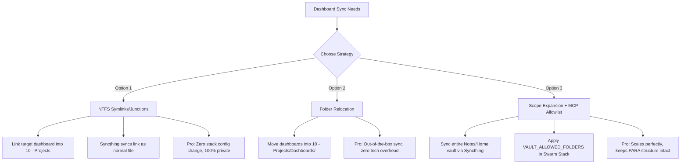

# Research — Vault Scope Expansion & Dashboard Synchronization Strategy

## 📋 Objective

To design a highly secure, frictionless, and privacy-preserving architecture that allows AI coding assistants (via the `obsidian` MCP server) to dynamically update specific master dashboards, task outlines, and action lists, without exposing daily journals, personal notes, or sensitive non-project data in the Obsidian Vault.

---

## 🔍 Context & Current State

1. **Vault Layout**: The vault uses a structured PARA-style directory layout:
   - `00 - Dashboard/` (Contains index maps, daily hubs, master indexes)
   - `01 - Inbox/` (Quick capture)
   - `10 - Projects/` (Contains active homelab, finance dev, and smart home subfolders)
   - `20 - Personal/` (Sensitive private notes)
   - `30 - Home/` (Household data)
   - `Journal/` (Sensitive daily logs)
2. **Current Boundary**:
   - **Syncthing** only synchronizes the `10 - Projects` folder to `/mnt/docker-data/vault` on the Swarm node `dev-node-01`.
   - **Vault Watcher** only monitors the `10 - Projects` folder.
   - The **MCP Server** only exposes `/vault` (which maps to the flat projects synced directory).
   - Any notes living in `00 - Dashboard/` or `Journal/` are completely isolated and invisible to the AI.

---

## 🗺️ Architectural Options Analysis

To synchronize dashboards (which traditionally live in `00 - Dashboard/` or vault root) while ensuring private folders (like `20 - Personal` or `Journal`) remain strictly secure, three main design options have been identified:



### 1. Option 1: NTFS Symlinks / Junction Points (Recommended - Low Friction)
Instead of shifting folder paths, create a hard symlink (Junction Point) inside the `10 - Projects/` folder that points directly to your target dashboard files inside `00 - Dashboard/` (or any other folder).

* **How it works**: 
  Open cmd as Administrator and run:
  ```cmd
  mklink "C:\Users\DJ\Documents\Notes\Home\10 - Projects\Homelab Dashboard.md" "C:\Users\DJ\Documents\Notes\Home\00 - Dashboard\Homelab Dashboard.md"
  ```
* **Pros**:
  - **100% Privacy Preservation**: Syncthing only syncs `10 - Projects/`, so *only* the specific whitelisted dashboard files are synced. Your personal journals and diaries remain completely off the Swarm server.
  - **Zero Configuration Overhead**: Requires no changes to Docker Swarm stacks, Portainer configs, Syncthing setups, or Windows watchers.
  - **Preserves PARA Structure**: The original dashboard notes continue to live neatly in `00 - Dashboard/` in your Obsidian UI.
* **Cons**:
  - Requires a manual one-time `mklink` command on the Windows host for each specific dashboard file you wish to expose.

---

### 2. Option 2: Folder Relocation (Simplest)
Move the specific dashboards, outlines, and task lists physically into the `10 - Projects/` folder (for example, creating a subdirectory `10 - Projects/Dashboards/` or placing them at the projects root).

* **How it works**:
  Drag and drop the target dashboard files into `10 - Projects/` via the Obsidian file explorer. Use local wikilinks or dashboard navigation grids to maintain access from your homepage.
* **Pros**:
  - **Zero Technical Complexity**: No terminal commands, symlinks, or config changes needed.
  - **Syncthing Native**: Works immediately with your existing active Syncthing pairing and vault-watcher.
* **Cons**:
  - Disrupts strict PARA-style layout if you prefer dashboards to remain separated from project-specific logs.

---

### 3. Option 3: Scope Expansion with Server-Side Allowlist (Enterprise-Grade)
Expand the Syncthing sync scope to synchronize your entire vault root `C:\Users\DJ\Documents\Notes\Home` to `/mnt/docker-data/vault`, and then strictly gate what the AI can see using environment variables on the Swarm container.

* **How it works**:
  1. Modify Syncthing to share the entire `Home` vault root.
  2. Update stack-obsidian-mcp.yml to add the following strict environment filters:
     ```yaml
     environment:
       - TRANSPORT=http
       - PORT=3000
       - VAULT_PATH=/vault
       - VAULT_ALLOWED_FOLDERS=10 - Projects,00 - Dashboard
       - VAULT_WRITE_FOLDERS=10 - Projects,00 - Dashboard
     ```
  3. Update `vault-watcher.ps1` to listen for trigger files at the new root or within the allowed directories.
* **Pros**:
  - **Highly Scalable**: If you decide to expose a new folder (e.g. `Learning` or `Templates`) in the future, you only need to add it to the stack's environment array—no filesystem changes required.
  - **Maintains Vault Folder Casing**: Preserves the absolute PARA directory structure in full inside the Swarm container.
* **Cons**:
  - **Exposes Vault Data to Swarm Host**: Syncthing must replicate the entire vault (including daily journals, financials, and private personal notes) to `dev-node-01`'s local SSD. Even if the MCP container blocks access via code, a root compromise of the Swarm VM would expose your entire personal vault.

---

## 🎯 Strategic Recommendation

### Short Term / Safe Phase: **Option 1 (NTFS Symlinks)**
To move quickly and with **absolute privacy safety**, using NTFS Symlinks is highly recommended. 
1. It requires **zero changes** to your Docker Swarm stacks or Syncthing setups.
2. It allows your coding assistant to immediately read and write to your master dashboards (e.g. `Homelab Dashboard.md` or a project roadmap) via the existing `obsidian` MCP tools.
3. Your personal logs remain perfectly air-gapped on your local Windows PC.

### Long Term / Scale Phase: **Option 3 (Scope Expansion with strict Allowlist)**
If you find yourself managing dozens of cross-linked outlines across multiple folders (e.g. `00 - Dashboard`, `10 - Projects`, and `Learning`), we can safely execute the **Scope Expansion**. This will involve:
1. Re-provisioning the Syncthing stack to sync the vault root.
2. Hard-hardening the MCP server environment with strict `VAULT_ALLOWED_FOLDERS` values.
3. Update the Windows folder watcher.

---

## 📅 Next Steps for Verification

- [ ] Select a specific dashboard note you wish to synchronize (e.g., your primary Homelab Dashboard or task outline).
- [ ] Test **Option 1** by running the `mklink` command in a Windows terminal for that file.
- [ ] Confirm that Syncthing successfully replicates the symlinked file to `dev-node-01` and that the MCP server can read/write it.
- [ ] If successful, document the symlink paths inside this note for future reference!
