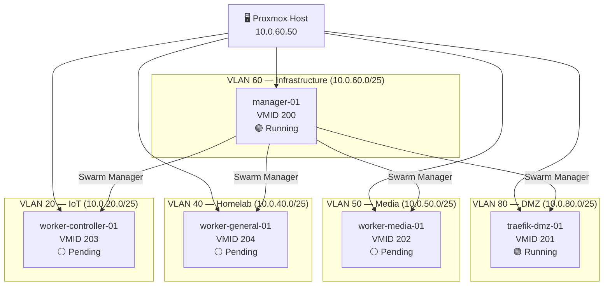

---

project_id: Homelab-2025 
phase: "Phase 5: Docker Swarm" 
tags:

- DockerSwarm
- Proxmox
- Tracking
- Overview updated: 2026-03-31

---

# 🖥️ Swarm Deployment Overview

> [!abstract] Purpose Living tracking document for the Docker Swarm cluster. Update status fields as VMs are provisioned and services are deployed. This is the single source of truth for "what is running, where, and what's next."

---

## 🗺️ Cluster Topology

> [!note] `traefik-dmz-01` is dual-homed — VLAN 80 (public ingress) + VLAN 60 (Swarm traffic). It appears in both segments above.

---

## 📋 VM Status

|VM|VMID|Primary VLAN|Secondary VLAN|vCPU|RAM|Status|Swarm Role|Node Label|
|---|---|---|---|---|---|---|---|---|
|`manager-01`|200|60|—|2|4GB|🟢 Running|Manager|`node.role=manager`|
|`traefik-dmz-01`|201|80|60|2|1GB|🟢 Running|Worker|`zone=public`|
|`worker-media-01`|202|50|—|4|8GB|⚪ Not provisioned|Worker|`type=media`|
|`worker-controller-01`|203|60|20|2|4GB|⚪ Not provisioned|Worker|`zone=controller`|
|`worker-general-01`|204|40|—|2|4GB|⚪ Not provisioned|Worker|`zone=homelab`|

**Status key:** 🟢 Running · 🟡 Provisioned / Post-boot pending · 🔴 Error · ⚪ Not provisioned · 🔵 In progress

---

## 🐳 Service Deployment Status

### Infrastructure Services

|Service|Stack|Target VM|Status|Notes|
|---|---|---|---|---|
|Portainer (server)|`portainer`|`manager-01`|🟡 Deploying|Port 9443 direct|
|Portainer agent|`portainer`|All nodes (global)|🟡 Deploying|Auto-scales as nodes join|
|Traefik v3|`traefik`|`traefik-dmz-01`|⚪ Pending|`acme.json` pre-create required|

### Media Services

|Service|Stack|Target VM|Status|Notes|
|---|---|---|---|---|
|Plex|`media`|`worker-media-01`|⚪ Pending|VM not provisioned|
|Sonarr|`media`|`worker-media-01`|⚪ Pending||
|Radarr|`media`|`worker-media-01`|⚪ Pending||
|Prowlarr|`media`|`worker-media-01`|⚪ Pending||
|Tautulli|`media`|`worker-media-01`|⚪ Pending||
|Transmission + Gluetun|`media`|`worker-media-01`|⚪ Pending|VPN sidecar|

### Controller Services

|Service|Stack|Target VM|Status|Notes|
|---|---|---|---|---|
|Home Assistant|`controllers`|`worker-controller-01`|⚪ Pending|IoT VLAN 20 access required|
|UniFi Controller|`controllers`|`worker-controller-01`|⚪ Pending||

### Monitoring Services

|Service|Stack|Target VM|Status|Notes|
|---|---|---|---|---|
|Prometheus|`monitoring`|`manager-01`|⚪ Pending|Was running on legacy server|
|Grafana|`monitoring`|`manager-01`|⚪ Pending|Was running on legacy server|
|InfluxDB|`monitoring`|`manager-01`|⚪ Pending|Was running on legacy server|

---

## 🗂️ ZFS Dataset Status

|Dataset|Pool Path|virtiofs Tag|Mount Point|Snapshot Cron|Notes|
|---|---|---|---|---|---|
|`docker-data`|`rpool/docker-data`|`docker-data`|`/mnt/docker-data`|⚪ Not configured|Docker data root, service configs|
|`docker-tsdb`|`rpool/docker-tsdb`|`docker-tsdb`|`/mnt/docker-tsdb`|⚪ Not configured|Prometheus, InfluxDB|
|`docker-db`|`rpool/docker-db`|`docker-db`|`/mnt/docker-db`|⚪ Not configured|Relational DBs|
|`docker-swarm`|`rpool/docker-swarm`|`docker-swarm`|`/mnt/docker-swarm`|⚪ Not configured|Stack files, shared configs|

> [!warning] ZFS snapshot cron not yet configured All datasets are unprotected by ZFS snapshots. PBS covers VM disks only — virtiofs passthroughs are host-side and not inside any VM zvol. Set up the snapshot cron before migrating live data. See [[Docker Swarm Infrastructure Runbook#Step 0.2]].

---

## 🔜 Next Steps

> All tasks, commands, and phase gates live in the runbook. → [[Docker Swarm Infrastructure Runbook]]

---

---

## 🏗️ Infrastructure Nodes (Non-Swarm)

|Node|Type|IP|VLAN|Status|Notes|
|---|---|---|---|---|---|
|Proxmox Host|Hypervisor|10.0.60.50|60/90|🟢 Running|Single node, `rpool` ZFS|
|pfSense|Firewall/Router|10.0.1.1|All|🟢 Running|VLAN routing, DHCP, NAT|
|PiHole 1|DNS|VLAN 60 DHCP|60|🟢 Running|Primary DNS|
|PiHole 2|DNS|VLAN 60 DHCP|60|🟢 Running|Secondary DNS|
|Extreme Switch|L2/L3 Switch|10.0.90.2|90|🟢 Running|48-port, VLAN trunk|

---

## 📝 Change Log

|Date|Change|
|---|---|
|2026-03-31|`manager-01` (VMID 200) provisioned, Swarm initialised|
|2026-03-31|`traefik-dmz-01` (VMID 201) provisioned, joined Swarm|
|2026-03-31|Portainer stack rewritten to agent mode, deploying|
|2026-03-31|Note created|

---

## 🔗 Related Notes

- [[Docker Swarm Infrastructure Runbook]]
- [[VLAN and Subnet Summary Sheet]]
- [[ZFS Configuration and Setup]]
- [[Traefik Setup]]
- [[Session Notes — Docker Swarm Pipeline Fixes]]
- [[Proxmox Network Setup]]