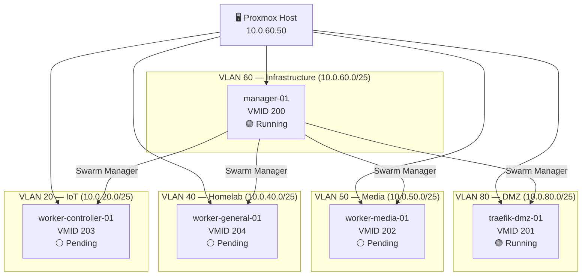

# 🖥️ Swarm Deployment Overview

> [!abstract] Purpose Living tracking document for the Docker Swarm cluster. Update status fields as VMs are provisioned and services are deployed. This is the single source of truth for "what is running, where, and what's next."

---

## 🗺️ Cluster Topology



> [!note] `traefik-dmz-01` is dual-homed — VLAN 80 (public ingress) + VLAN 60 (Swarm traffic). It appears in both segments above.

---

## 📋 VM Status

```dataviewjs
const pages = dv.pages('"10 - Projects"')
  .where(p => p.type === "swarm-vm")
  .sort(p => p.vmid ?? 999, "asc");

const statusIcon = s => ({
  "not-created": "⬜",
  "provisioned": "🟡",
  "post-boot-complete": "🟠",
  "running": "🟢",
}[s] ?? "❓");

dv.table(
  ["VM", "VMID", "VLAN(s)", "IP", "vCPU", "RAM", "Status", "Role", "Post-Boot", "Joined"],
  pages.map(p => [
    p.file.link,
    p.vmid ?? "—",
    [p.vlan_primary, p.vlan_secondary].filter(Boolean).join(" + "),
    p.ip_primary ?? "—",
    p.vcpu ?? "—",
    p.ram_gb ? p.ram_gb + "GB" : "—",
    statusIcon(p.vm_status) + " " + (p.vm_status ?? "—"),
    p.swarm_role ?? "—",
    p.post_boot_run ? "✅" : "🔲",
    p.swarm_joined ? "✅" : "🔲",
  ])
);
```

**Status key:** ⬜ Not created · 🟡 Provisioned · 🟠 Post-boot complete · 🟢 Running · ❓ Unknown

---

## 🐳 Service Deployment Status

```dataviewjs
const pages = dv.pages('"10 - Projects"')
  .where(p => p.type === "swarm-service")
  .sort(p => p.service_name, "asc");

const statusIcon = s => ({
  "pending":   "⬜",
  "deploying": "🟡",
  "deployed":  "🟢",
  "running":   "🟢",
  "degraded":  "🔴",
}[s] ?? "❓");

dv.table(
  ["Service", "VM", "Status", "Port", "External", "Internal URL", "ZFS Dataset"],
  pages.map(p => [
    p.file.link,
    p.vm ?? "—",
    statusIcon(p.service_status) + " " + (p.service_status ?? "—"),
    p.port ?? "—",
    p.external_access ? "🌐 Yes" : "🔒 No",
    p.url_internal ?? "—",
    p.zfs_dataset ?? "—",
  ])
);
```

**Status key:** ⬜ Pending · 🟡 Deploying · 🟢 Deployed/Running · 🔴 Degraded

> [!note] This table is auto-populated from individual `Service - *.md` notes. Update `service_status` in the relevant note to update this view.

---

## 🗂️ ZFS Dataset Status

|Dataset|Pool Path|virtiofs Tag|Mount Point|Snapshot Cron|Notes|
|---|---|---|---|---|---|
|`docker-data`|`rpool/docker-data`|`docker-data`|`/mnt/docker-data`|⚪ Not configured|Docker data root, service configs|
|`docker-tsdb`|`rpool/docker-tsdb`|`docker-tsdb`|`/mnt/docker-tsdb`|⚪ Not configured|Prometheus, InfluxDB|
|`docker-db`|`rpool/docker-db`|`docker-db`|`/mnt/docker-db`|⚪ Not configured|Relational DBs|
|`docker-swarm`|`rpool/docker-swarm`|`docker-swarm`|`/mnt/docker-swarm`|⚪ Not configured|Stack files, shared configs|
|`downloads`|`MainStorage/downloads`|`downloads`|`/mnt/downloads`|⚪ Not configured|153G used — downloads staging (seeding in progress)|

> [!warning] ZFS snapshot cron not yet configured All datasets are unprotected by ZFS snapshots. PBS covers VM disks only — virtiofs passthroughs are host-side and not inside any VM zvol. Set up the snapshot cron before migrating live data. See [[Docker Swarm Infrastructure Runbook#Step 0.2]].

---

## 🔜 Next Steps

> All tasks, commands, and phase gates live in the runbook. → [[Docker Swarm Infrastructure Runbook]]

---

---

## 🏗️ Infrastructure Nodes (Non-Swarm)

|Node|Type|IP|VLAN|Status|Notes|
|---|---|---|---|---|---|
|Proxmox Host|Hypervisor|10.0.60.50|60/90|🟢 Running|Single node, `rpool` ZFS|
|pfSense|Firewall/Router|10.0.1.1|All|🟢 Running|VLAN routing, DHCP, NAT|
|PiHole 1|DNS|VLAN 60 DHCP|60|🟢 Running|Primary DNS|
|PiHole 2|DNS|VLAN 60 DHCP|60|🟢 Running|Secondary DNS|
|Extreme Switch|L2/L3 Switch|10.0.90.2|90|🟢 Running|48-port, VLAN trunk|

---

## 📝 Change Log

|Date|Change|
|---|---|
|2026-03-31|`manager-01` (VMID 200) provisioned, Swarm initialised|
|2026-03-31|`traefik-dmz-01` (VMID 201) provisioned, joined Swarm|
|2026-03-31|Portainer stack rewritten to agent mode, deploying|
|2026-03-31|Note created|
|2026-04-21|Bug #21: asymmetric routing on `traefik-dmz-01` temp-fixed (`ip route del`). Permanent netplan fix outstanding.|
|2026-04-21|Bug #22: overlay subnet collision fixed — all stacks redeployed with pinned `10.200.x.0/24` subnets|
|2026-04-21|Plex external DNS configured (`plex CNAME → ddns.purvishome.com`). Browser test pending.|
|2026-04-21|VM notes updated to reflect actual running state. DataviewJS tables added for VM and Service status.|
|2026-04-26|rpool recovered — 577G free. Stale ZFS datasets destroyed (swarm-mgr* placeholders + manager_test).|
|2026-04-26|`MainStorage/downloads` created (lz4, atime=off, recordsize=1M). Downloads migrated SSD→MainStorage HDD (153G). Old `rpool/data/vm-204-downloads` 500G zvol destroyed.|
|2026-04-27|InfluxDB token fixed, v1 compat configured (DBRP + v1 auth). Grafana InfluxQL + Flux datasources working.|
|2026-04-27|Monitoring stack: InfluxDB added to traefik-public network (Bug #43). Traefik metrics fixed (Bug #44).|
|2026-04-27|Transmission + Gluetun deployed via compose-vpn.yml. Arr stack (Sonarr, Radarr, Prowlarr) all 1/1.|
|2026-04-27|MainStorage cleanup: vm-100/106/108 disks destroyed (~208G). downloads quota=500G. backups dataset created (150G reserved).|
|2026-04-26|`worker-mediamanagement-01` `/mnt/downloads` — virtiofs mounted, fstab persisted (virtiofs entry only).|
|2026-04-26|Old LXC subvolumes cleared from MainStorage: subvol-101–105, subvol-109 (~150G recovered).|
|2026-04-26|subvol-110 downloads migration in progress — `mv` running at session end. Destroy after verification.|
|2026-04-26|Prowlarr indexer sync configured in Sonarr and Radarr.|

---

## 🔗 Related Notes

- [[Docker Swarm Infrastructure Runbook]]
- [[VLAN and Subnet Summary Sheet]]
- [[ZFS Configuration and Setup]]
- [[Traefik Setup]]
- [[Session Notes — 2026-03-31 — Docker Swarm Pipeline Fixes]]
- [[Proxmox Network Setup]]